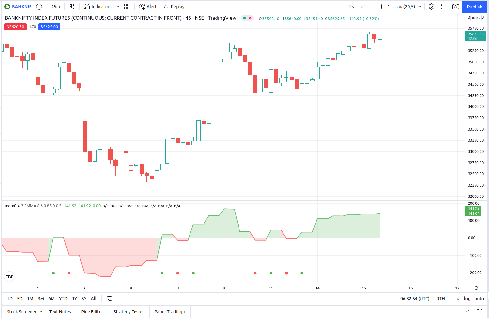

# Mom_indicator_0.5 "momentom"

***only education perpose***
The indicator alert based on JayRogers "Open Close Cross Strategy R2" 
This indicator alert created for TradingView alarm sub-system. Also this indicator plots the Difference Factor between the Close and Open Moving Averages, this gives a good indication of strength of move. Also included in this release is optional Divergence finder with variable width channel.

Backtest Report

Hindustan Uniliver 1-yr

Infosys

ITC

Bitcoin

***Note:***
this is a high frequency strategy which require a large sum to invest and this back test report dosen't include trading fee and other casual charges.
the actual results could be far differnt
